<p align="center">
  <a href="https://github.com/viethua99/KMP-Stable-Diffusion/releases">
     
  </a>

  <a href="https://opensource.org/licenses/Apache-2.0">
     
  </a>

  <a href="https://github.com/viethua99">
     
  </a>

  <a href="https://www.linkedin.com/in/viet-hua-3255a2181/">
     
  </a>

</p>


## Supporters
[](https://github.com/viethua99/KMP-Stable-Diffusion/stargazers)

## Features
### Stable Diffusion:

| Text To Image                                             | Image To Image                                            |
|-----------------------------------------------------------|-----------------------------------------------------------|
|  |  |

### Others:

| Save Locally                                               | Dark / Light Mode                                             |
|------------------------------------------------------------|---------------------------------------------------------------|
|  | 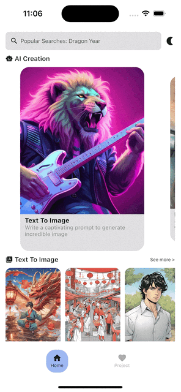 |


<details>
<summary>Expand to see supported styles</summary>

| Style        | Sample                                                                        | Style        | Sample                                                                         |
|--------------|-------------------------------------------------------------------------------|--------------|--------------------------------------------------------------------------------|
| Anime        | 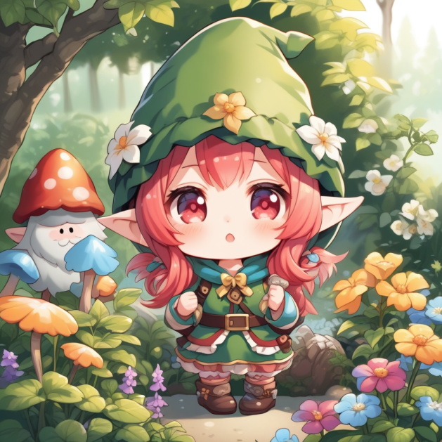        | Origami      |        |
| 3D Model     |       | Line Art     | 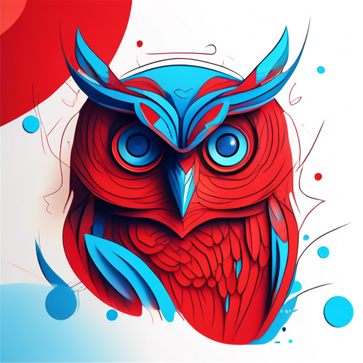      |
| Photographic | 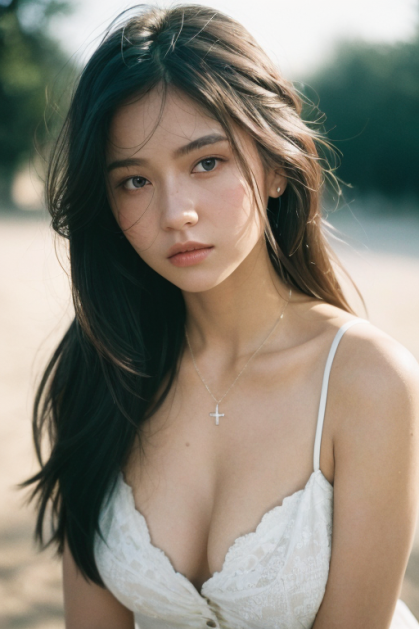 | Analog Film  | 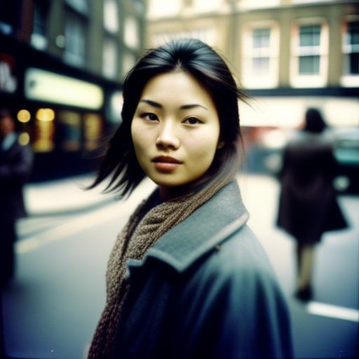   |
| Comic Book   | 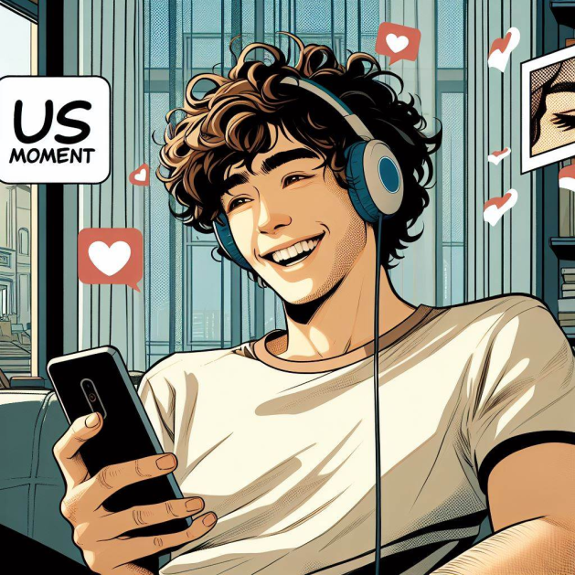   | Cinematic    |      |
| Pixel Art    |     | Isometric    |      |
| Neon Punk    |     | Low Poly     |       |
| Fantasy Art  | 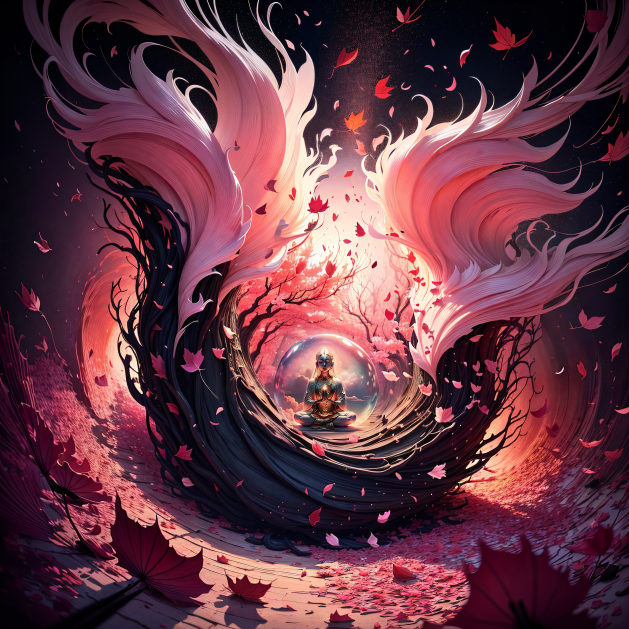  | Tile Texture |  |
| Digital Art  |   |
</details>

## Screenshots
### Android

  <div style="display: flex; width: 100%">
  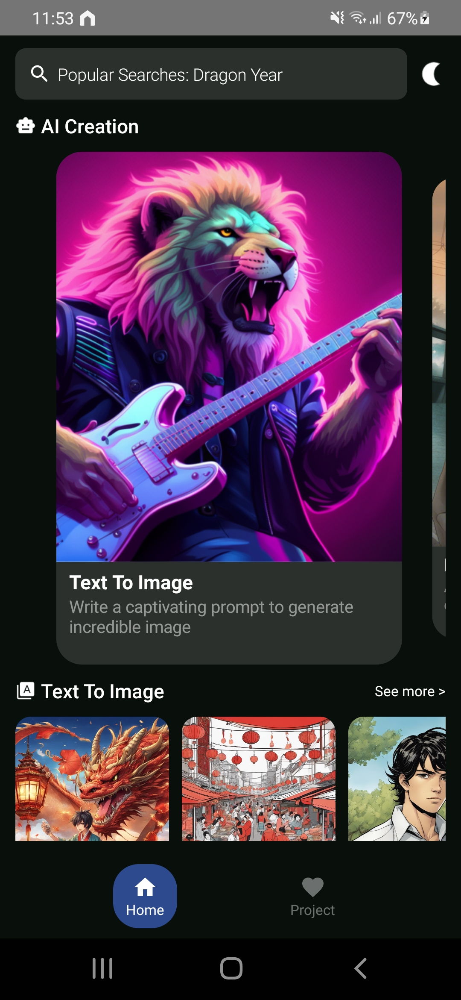
  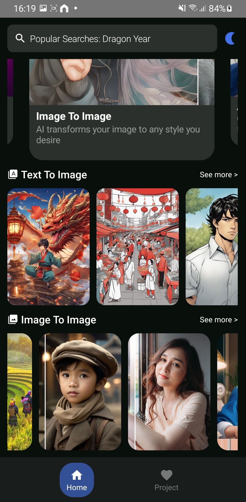
  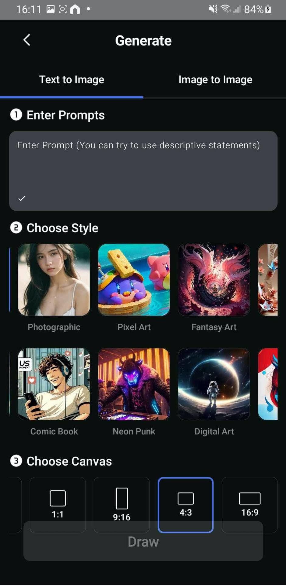
  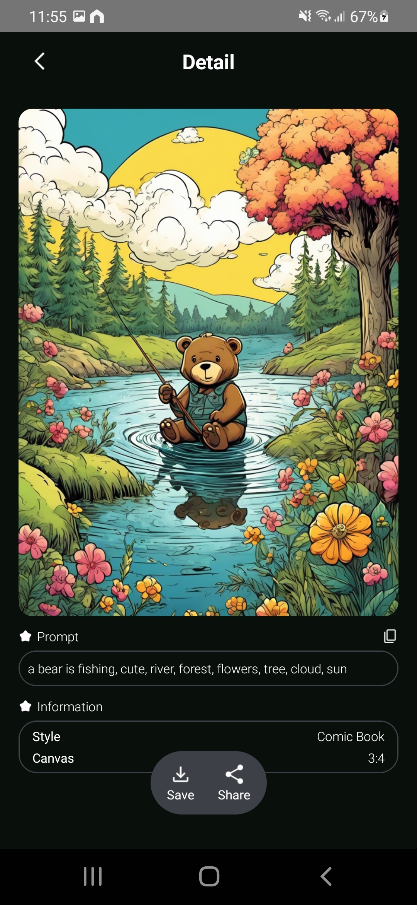
  </div>

### iOS

  <div style="display: flex; width: 100%">
  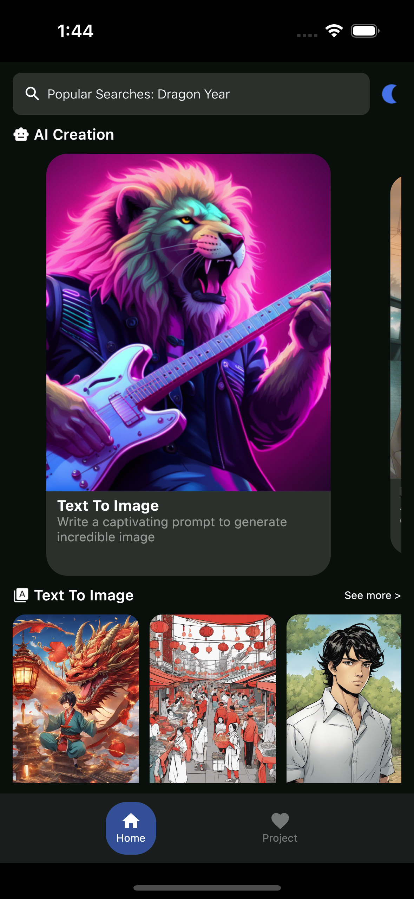
  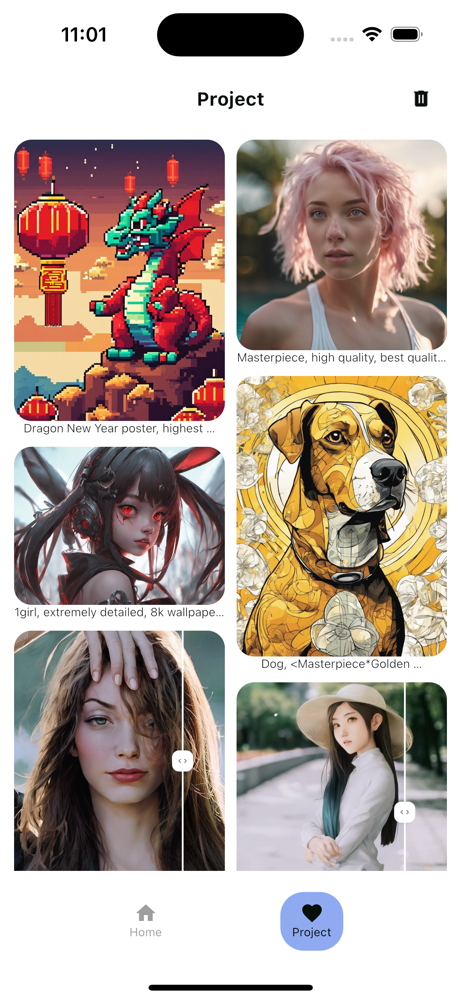
  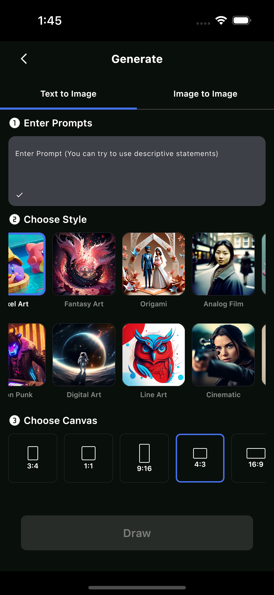
  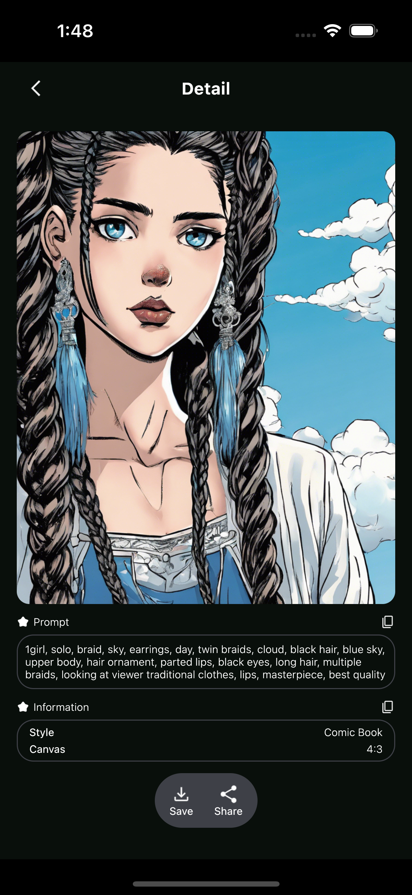
  </div>

## Setup
### Stability AI
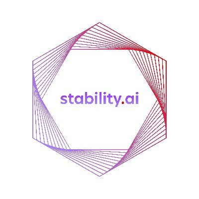

This project using the [Stability AI API](https://stability.ai/) for constructing RESTful API. Stability AI provides a RESTful API interface to highly detailed objects built from thousands of lines of data related to text to images.

- Step 1: Create an account and generate an API key at [Stability AI](https://platform.stability.ai/docs/getting-started)

- Step 2: Paste the API key to your project `gradle.properties` file:
<pre><code class="lang-groovy">STABLE_DIFFUSION_API_KEY=YOUR_API_KEY_HERE</code></pre>

- Step 3: Sync project and run your app
### Android
Select `composeApp` configuration and run the project.
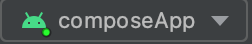

### iOS
Select `iOSApp` configuration and run the project.


## Technical Dependencies
- [Kotlin](https://kotlinlang.org/) based, [Coroutines](https://github.com/Kotlin/kotlinx.coroutines) + [Flow](https://kotlin.github.io/kotlinx.coroutines/kotlinx-coroutines-core/kotlinx.coroutines.flow/) for asynchronous.
- [Composable Multiplatform](https://jb.gg/compose) for building common UI. It simplifies and accelerates UI development on Android, iOS and Desktop.
- [Koin](https://insert-koin.io/) for dependency injection.
- [Moko Resources](https://github.com/adrielcafe/voyager) for multiplatform string and images resources.
- [Ktor & Kotlin Serialization](https://ktor.io/) for constructing the REST APIs and paging network data.
- [SqlDelight](https://cashapp.github.io/sqldelight/2.0.1/) for local database.
- [Voyager](https://github.com/adrielcafe/voyager) for navigation and screen models.


## Project Structure
### Common Structure
```
├── composeApp
│   ├── androidMain
│   ├── commonMain
│   │   ├── kotlin/com/vproject/stablediffusion
│   │   │   ├── database
│   │   │   │   ├── dao                                      <––– Data Access Object (DAOs)
│   │   │   │   └── ...
│   │   │   ├── di                                           <––– Koin Depedenency Injection package
│   │   │   ├── model
│   │   │   ├── network
│   │   │   │    ├── StableDiffusionApi.kt                   <––– RESTFul APIs
│   │   │   │    └── ...
│   │   │   ├── presentation
│   │   │   │   ├── component
│   │   │   │   ├── screen
│   │   │   │   │   ├── generate                             <––– Generate Screen package
│   │   │   │   │   │   ├── GenerateScreen.kt                <––– Composable Generate Screen UIs
│   │   │   │   │   │   ├── GenerateModel.kt                 <––– Generate Screen View Model
│   │   │   │   │   │   └── GenerateUiState.kt               <––– Generate Sealed class UI State
│   │   │   │   │   └── ...
│   │   │   ├── repository
│   │   │   │   ├── ImageRepository.kt                       <––– Image repository to send requests
│   │   │   │   └── ...
│   │   │   └── util
│   │   ├── resources                                        <––– Moko Resources to store local images and strings
│   │   └── sqldelight/com/vproject/stablediffusion          <––– Local database entities
│   ├── desktopMain
│   └── iosMain
└── ...
```
### System Design
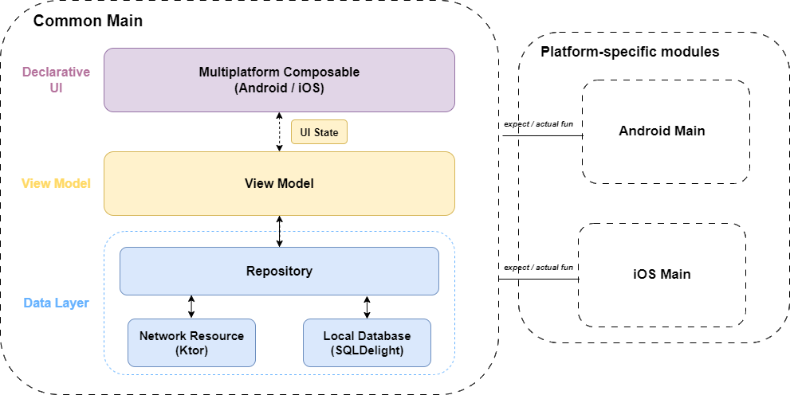

## Download
Go to the [Releases](https://github.com/viethua99/KMP-Stable-Diffusion/releases) to download the latest APK version.

## License
**KMP-Stable-Diffusion** is distributed under the terms of the Apache License (Version 2.0). See the
[license](LICENSE) for more information.