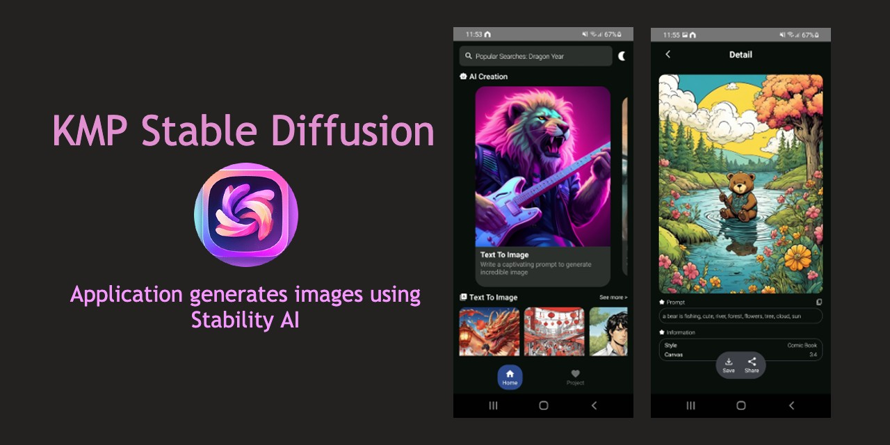
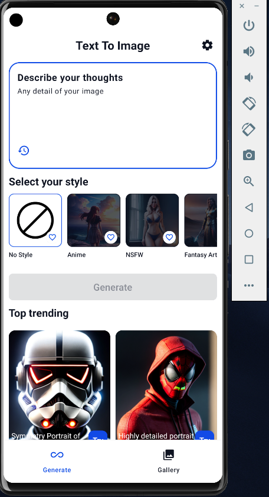
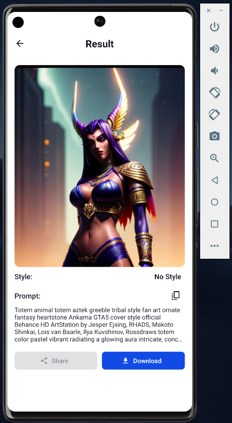
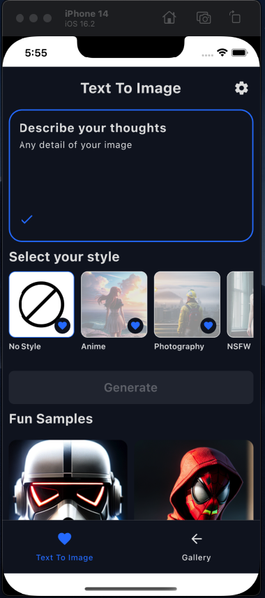
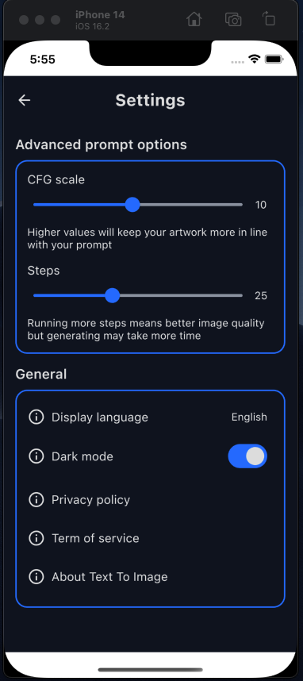
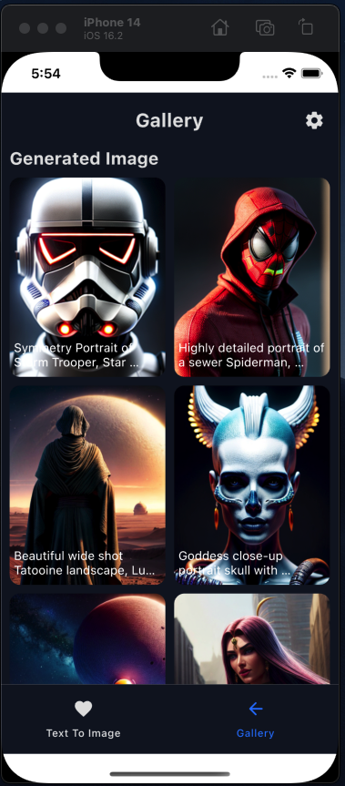
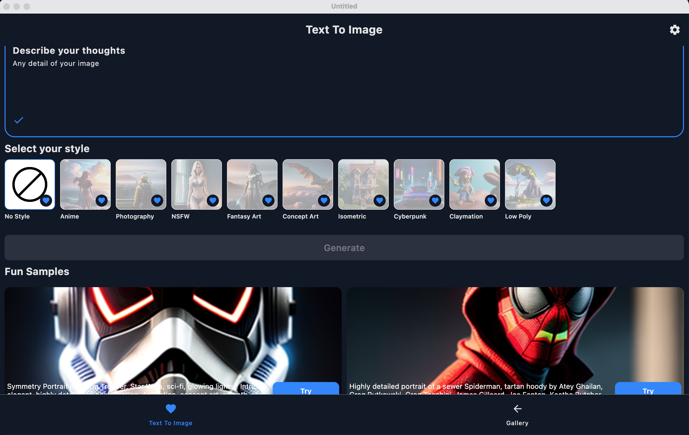

  

  

  

  

## Download
Go to the [Releases](https://github.com/viethua99/KMP-Stable-Diffusion/releases) to download the latest APK version.

## Features

- Type in your prompt and start generating images.
- Multiple styles to customize your images.
> 🔞 **There is a style call [NSFW] (Not Safe For Work) that exposes nudity content. Please make sure you are older than 18 to use** 🔞
- Support Light / Dark mode.
- You are able to download the generated images.
- Support 2 languages (English and Vietnamese).

## Showcase
### Android

|  |  |  |
|--------------------------------------------------------------|--------------------------------------------------------------|--------------------------------------------------------------|
### iOS

|  |  |  |
|----------------------------------------------------------|----------------------------------------------------------|----------------------------------------------------------|
### Desktop

## Setup
### Stable Diffusion API

KMP-Stable-Diffusion using the [Stable Diffusion API](https://stablediffusionapi.com/) for constructing RESTful API. 
StableDiffusionAPI provides a RESTful API interface to highly detailed objects built from thousands of lines of data related to text to images.

Step 1: Create an account and generate an API key at [Stable Diffusion API Key](https://stablediffusionapi.com/dashboard/apikeys)

Step 2: Paste the API key to your project `gradle.properties` file:
<pre><code class="lang-groovy">STABLE_DIFFUSION_API_KEY=YOUR_API_KEY_HERE</code></pre>

Step 3: Sync project and run your app
### Android
Select `composeApp` configuration and run the project.

### iOS
Select `iOSApp` configuration and run the project.

### Desktop
On your terminal, run this command to open:
<pre><code class="lang-groovy">./gradlew :app-desktop:run</code></pre>

## Technical Dependencies
- [Kotlin](https://kotlinlang.org/) based, [Coroutines](https://github.com/Kotlin/kotlinx.coroutines) + [Flow](https://kotlin.github.io/kotlinx.coroutines/kotlinx-coroutines-core/kotlinx.coroutines.flow/) for asynchronous.
- [Composable Multiplatform](https://jb.gg/compose) for building common UI. It simplifies and accelerates UI development on Android, iOS and Desktop.
- [Koin](https://insert-koin.io/) for dependency injection.
- [Ktor & Kotlin Serialization](https://ktor.io/)for constructing the REST APIs and paging network data.
- [Kamel](https://github.com/Kamel-Media/Kamel) for loading images from network.
- [Voyager](https://github.com/adrielcafe/voyager) for navigation and screen models.

- Architecture:
  - MVVM Architecture (View - ViewModel - Model)
  - Repository Pattern

## Modularization
KMP-Stable-Diffusion also has another version which is based on Android Modularization concept and architecture to develop. Please check out [compose-modularization](https://github.com/viethua99/KMP-Stable-Diffusion/tree/compose-modularization) branch for more details.

## Find this repository useful? :heart:
Support it by joining __[stargazers](https://github.com/viethua99/KMP-Stable-Diffusion/stargazers)__ for this repository. :star:  
Also, __[follow me](https://github.com/viethua99)__ on GitHub for my next creations! 🤩

## License

**KMP-Stable-Diffusion** is distributed under the terms of the Apache License (Version 2.0). See the
[license](LICENSE) for more information.