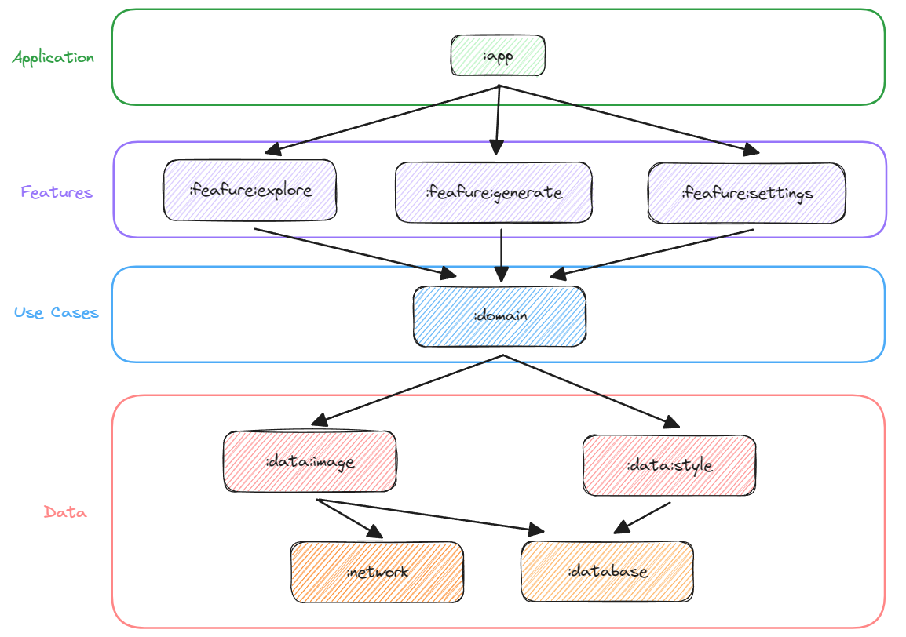
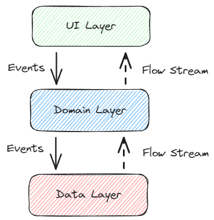
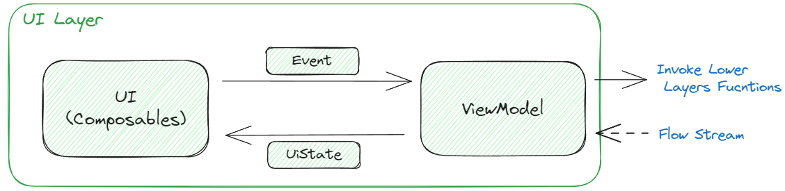
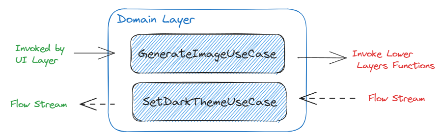
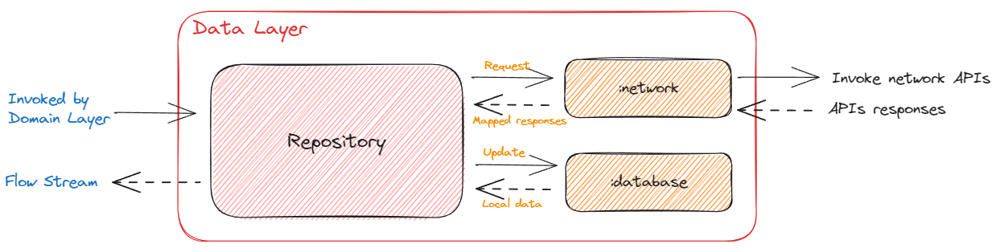

  

  

## Features

- Type in your prompt and start generating images.
- Multiple styles to customize your images.
> 🔞 **There is a style call [NSFW] (Not Safe For Work) that exposes nudity content. Please make sure you are older than 18 to use** 🔞
- Support Light / Dark mode.
- You are able to download the generated images. (In-progress)
- Support 2 languages (English and Vietnamese). (In-progress)

## Technical Dependencies
- [Kotlin](https://kotlinlang.org/) based, [Coroutines](https://github.com/Kotlin/kotlinx.coroutines) + [Flow](https://kotlin.github.io/kotlinx.coroutines/kotlinx-coroutines-core/kotlinx.coroutines.flow/) for asynchronous.
- Jetpack
  - Composable: Android’s recommended modern toolkit for building native UI. It simplifies and accelerates UI development on Android.
  - ViewModel: Manages UI-related data holder and lifecycle aware. Allows data to survive configuration changes such as screen rotations.
  - Room: Constructs Database by providing an abstraction layer over SQLite to allow fluent database access.
  - Navigation Component: Constructs Database by providing an abstraction layer over SQLite to allow fluent database access.
  - [Hilt](https://dagger.dev/hilt/): for dependency injection.
- Architecture
  - MVVM Architecture (View - ViewModel - Model)
  - Repository Pattern
- [Retrofit2 & OkHttp3](https://github.com/square/retrofit): Construct the REST APIs and paging network data.
- [Coil](https://github.com/coil-kt/coil): Loading images from network.

## Architecture / Modularization
**Android Text-to-Image** is based on the MVVM architecture, which follows the [Google's official architecture guidance](https://developer.android.com/topic/architecture).

The overall architecture of **Android Text-to-Image** is composed of three layers; the UI layer, the Domain layer and the Data layer. Each layer has dedicated components and they have each different responsibilities, as defined below:

- **Re-usability**: Modularizing reusable codes properly enable opportunities for code sharing and limits code accessibility in other modules at the same time.
- **Parallel Building**: Each module can be run in parallel and it reduces the build time.
- **Strict visibility control**: Modules restrict to expose dedicated components and access to other layers, so it prevents they're being used outside the module
- **Decentralized focusing**: Each developer team can assign their dedicated module and they can focus on their own modules.

For more information, check out the [Guide to Android app modularization](https://developer.android.com/topic/modularization).

### Architecture Overview

- The UI layer emits user events to the data layer, and the data layer exposes data as a stream to other layers.
- The Domain layer is responsible for encapsulating complex business logic, or simple business logic that is reused by multiple ViewModels.
- The Data layer is designed to work independently from other layers and must be pure, which means it doesn't have any dependencies on the other layers.

With this loosely coupled architecture, you can increase the reusability of components and scalability of your app.

### UI Layer

The UI layer consists of UI elements and UI previews to configure screens that could interact with users and [ViewModel](https://developer.android.com/topic/libraries/architecture/viewmodel) that holds UI states and restores data when configuration changes.
- UI composable components observe the UI states via coroutine flows, which is the most essential part of the MVVM architecture.

### Domain Layer

The Domain Layer consists of use cases, which fit between ViewModels from the UI layer and repositories from the data layer, they communicate with the UI layer the same way repositories do—using coroutines. 

### Data Layer

The Data layer consists of repositories, which include business logic, such as querying data from the local database and requesting remote data from the network. It is implemented as an offline-first source of business logic and follows the [single source of truth](https://en.wikipedia.org/wiki/Single_source_of_truth) principle. 

**Android Text-to-Image** is an offline-first app is an app that is able to perform all, or a critical subset of its core functionality without access to the internet.
So users don't need to be up-to-date on the network resources every time and it will decrease users' data consumption. For further information, you can check out [Build an offline-first app](https://developer.android.com/topic/architecture/data-layer/offline-first).

## Stable Diffusion API

Android Text-to-Image using the [Stable Diffusion API](https://stablediffusionapi.com/) for constructing RESTful API. 
StableDiffusionAPI provides a RESTful API interface to highly detailed objects built from thousands of lines of data related to text to images.
## Setup
Step 1: Create an account and generate an API key at [Stable Diffusion API Key](https://stablediffusionapi.com/dashboard/apikeys)

Step 2: Paste the API key to your project `gradle.properties` file:
<pre><code class="lang-groovy">STABLE_DIFFUSION_API_KEY=YOUR_API_KEY_HERE</code></pre>

Step 3: Sync project and run your app.

## Find this repository useful? :heart:
Support it by joining __[stargazers](https://github.com/viethua99/Android-Text-to-Image/stargazers)__ for this repository. :star:  
Also, __[follow me](https://github.com/viethua99)__ on GitHub for my next creations! 🤩

## License

**Android Text-to-Image** is distributed under the terms of the Apache License (Version 2.0). See the
[license](LICENSE) for more information.