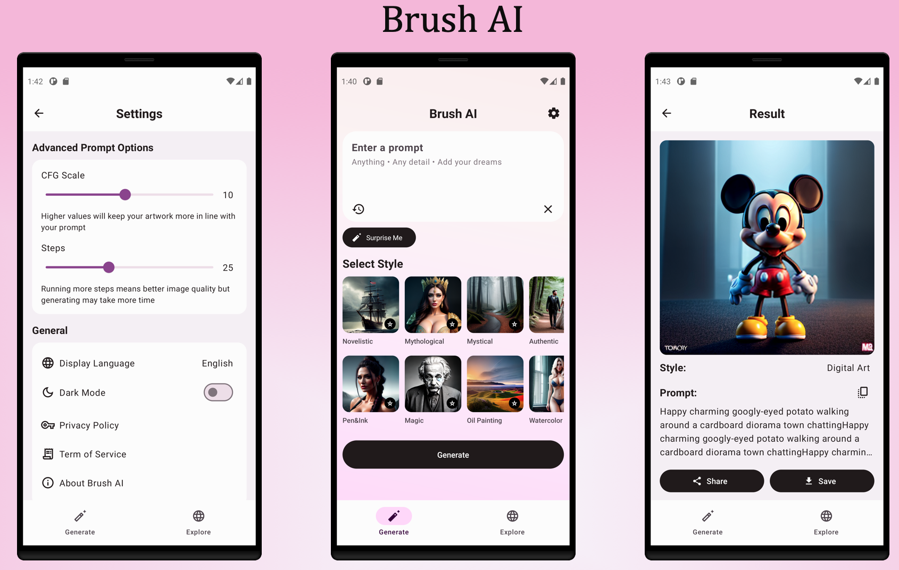

<h1 align="center"><b>Brush AI</b></h1>

  <i align="center">🚀 Instantly generate high-quality images based on your text prompt 🚀</i>

<h4 align="center">
  
</h4>

## 🎨 What Is Brush AI?
Brush AI is an Android app project that generates and downloads images from your prompt using Stable Diffusion APIs. The project is entirely built with Jetpack Compose and MVVM Architecture combined with feature modularization.
## 🎨 Showcase
Add some videos and showcases images here.

## 🎨 Features
- Type in your prompt and start generating images.
- Multiple styles to customize your images.
- You are able to download the generated images.
- Support 2 languages (English and Vietnamese).
- Support Light / Dark mode.

## 🎨 Architecture
- Android Jetpack Compose with Kotlin Coroutines / Flow.
- Modularization and MVVM architecture.
- Testing-driven development (TDD) with Unit Testing and Instrument Testing.
- Retrofit Dependency for RESTful APIs.
- Room Dependency for local database.
- Version Catalogs and Convention Plugins to manage and share Gradle dependencies between modules. 

## License

**Brush AI** is distributed under the terms of the Apache License (Version 2.0). See the
[license](LICENSE) for more information.